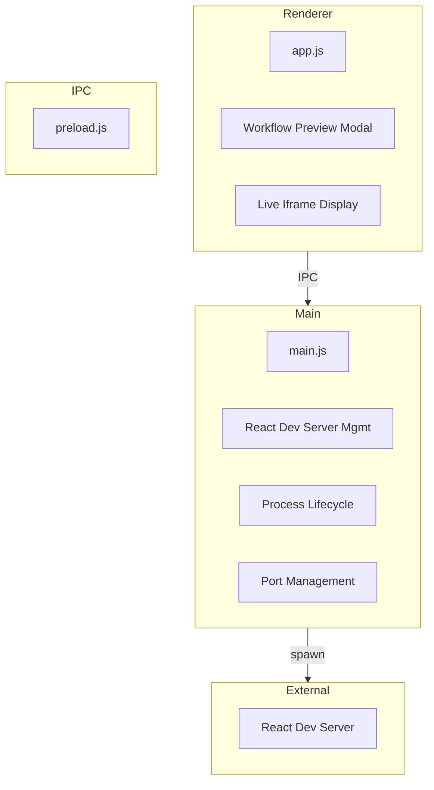
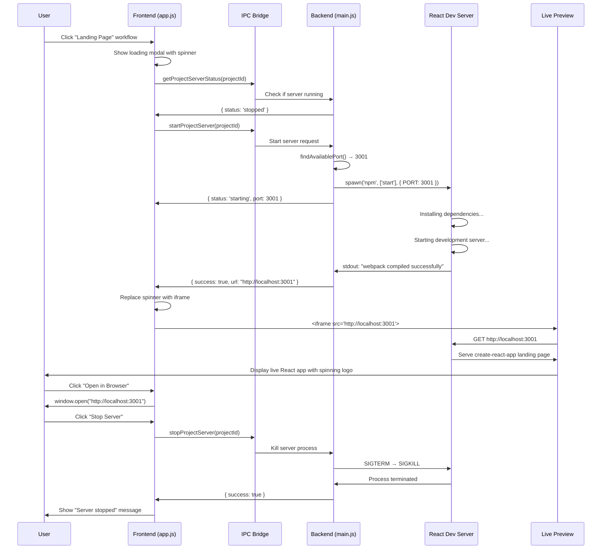

# Phase 5 - Live React Dev Server Preview Architecture

## System Overview Diagram



## Live Preview Sequence Diagram



## Component Architecture Diagram

```
┌─────────────────────────────────────────────────────────────────────┐
│                        Frontend Components                          │
├─────────────────────────────────────────────────────────────────────┤
│  openWorkflowPreview(project, workflow)                            │
│  ├─ Creates workflow preview modal                                 │
│  ├─ Shows loading spinner initially                               │
│  └─ Calls generateLandingPagePreview() [ASYNC]                    │
│                                                                     │
│  generateLandingPagePreview(project, workflow)                     │
│  ├─ Checks server status via IPC                                  │
│  ├─ Starts server if needed                                       │
│  └─ Returns HTML with iframe or loading state                     │
│                                                                     │
│  generatePreviewContent(serverUrl, status, project)               │
│  ├─ 'running'  → <iframe src="http://localhost:3001">           │
│  ├─ 'starting' → Loading spinner with progress message            │
│  └─ 'failed'   → Error message with retry button                 │
├─────────────────────────────────────────────────────────────────────┤
│                        Backend Components                           │
├─────────────────────────────────────────────────────────────────────┤
│  startProjectServer(project)                                       │
│  ├─ findAvailablePort() → 3000, 3001, 3002...                   │
│  ├─ spawn('npm', ['start'], { PORT: port, BROWSER: 'none' })     │
│  ├─ Monitor stdout for "webpack compiled successfully"            │
│  └─ Return { success: true, url: "http://localhost:port" }       │
│                                                                     │
│  stopProjectServer(projectId)                                      │
│  ├─ Get server info from projectServers Map                       │
│  ├─ serverProcess.kill('SIGTERM')                                 │
│  ├─ setTimeout(() => kill('SIGKILL'), 5000)                      │
│  └─ Clean up usedPorts Set and projectServers Map                 │
│                                                                     │
│  Process Lifecycle Management                                       │
│  ├─ projectServers = new Map()  // Track by project ID           │
│  ├─ usedPorts = new Set()       // Track allocated ports          │
│  └─ process.on('exit') → cleanup all servers                     │
└─────────────────────────────────────────────────────────────────────┘
```

## Data Flow Diagram

```
┌─────────────────┐    ┌─────────────────┐    ┌─────────────────┐
│   User Action   │───▶│  Frontend State │───▶│  Backend State  │
│                 │    │                 │    │                 │
│ Click Workflow  │    │ Modal: loading  │    │ Server: start   │
│                 │    │                 │    │                 │
└─────────────────┘    └─────────────────┘    └─────────────────┘
                                │                        │
                                ▼                        ▼
┌─────────────────┐    ┌─────────────────┐    ┌─────────────────┐
│  Live Preview   │◀───│   IPC Bridge    │◀───│ React Dev Server│
│                 │    │                 │    │                 │
│ iframe display  │    │ Secure comms    │    │ npm start :3001 │
│                 │    │                 │    │                 │
└─────────────────┘    └─────────────────┘    └─────────────────┘
```

## State Management Flow

```javascript
// Frontend State Transitions
User Click → Loading Spinner → Server Starting → Live Iframe

// Backend Process States  
'stopped' → 'starting' → 'running' → 'stopped'
    ↓           ↓           ↓           ↓
  No Process  npm start   HTTP Ready  Process Kill

// Port Allocation
usedPorts: Set([3000, 3001]) → findAvailablePort() → 3002
projectServers: Map({
  'proj_123': { process: ChildProcess, port: 3001, status: 'running' },
  'proj_456': { process: ChildProcess, port: 3002, status: 'starting' }
})
```

## Error Handling Strategy

```
┌─────────────────────────────────────────────────────────────────────┐
│                        Error Scenarios                              │
├─────────────────────────────────────────────────────────────────────┤
│  Server Start Failure                                               │
│  ├─ npm start exits with error code                                │
│  ├─ Timeout after 30 seconds                                       │
│  ├─ Port already in use                                            │
│  └─ Display: Error message + Retry button                          │
│                                                                     │
│  Server Health Monitoring                                           │
│  ├─ Watch process stdout/stderr                                    │
│  ├─ Detect "webpack compiled successfully"                         │
│  ├─ Handle process crashes                                         │
│  └─ Update frontend status in real-time                           │
│                                                                     │
│  Cleanup on Exit                                                    │
│  ├─ App close → Kill all running servers                          │
│  ├─ Server stop → SIGTERM → wait 5s → SIGKILL                    │
│  ├─ Port cleanup → usedPorts.delete(port)                        │
│  └─ Memory cleanup → projectServers.delete(id)                    │
└─────────────────────────────────────────────────────────────────────┘
```

## Performance Considerations

**Process Management**:
- **Lazy Server Starting**: Only start when workflow preview is requested
- **Server Reuse**: Keep servers running between preview sessions
- **Resource Limits**: Monitor memory usage of React dev servers
- **Port Pool**: Pre-allocate port ranges to avoid conflicts

**Frontend Optimization**:
- **Loading States**: Immediate feedback while server starts (30s)
- **Iframe Sandboxing**: Secure isolation of React dev server content
- **Error Boundaries**: Graceful handling of preview failures
- **Status Caching**: Cache server status to avoid repeated IPC calls

**Backend Efficiency**:
- **Process Monitoring**: Minimal overhead stdout parsing
- **Graceful Shutdown**: Proper SIGTERM handling before SIGKILL
- **Resource Cleanup**: Automatic cleanup on unexpected exits
- **Port Management**: Efficient port allocation and deallocation

This architecture provides authentic live previews while maintaining system stability and performance.