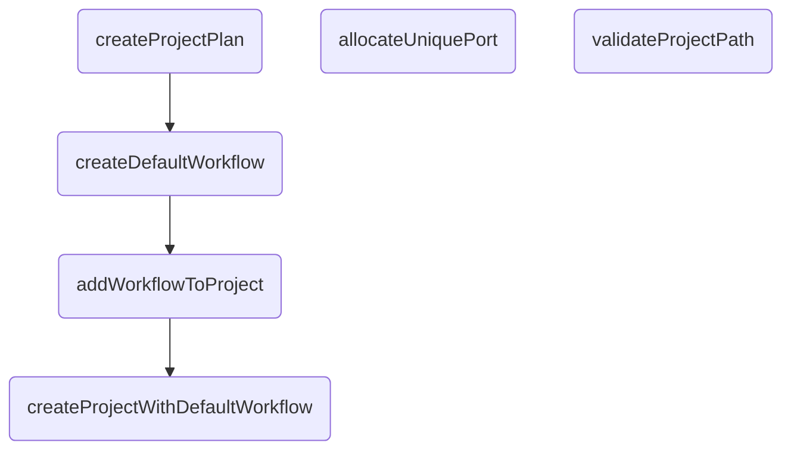

# Function Map

```mermaid
graph TD
    A(createProjectPlan) --> B(createDefaultWorkflow)
    B --> C(addWorkflowToProject)
    C --> D(createProjectWithDefaultWorkflow)
    E(allocateUniquePort)
    F(validateProjectPath)
```
